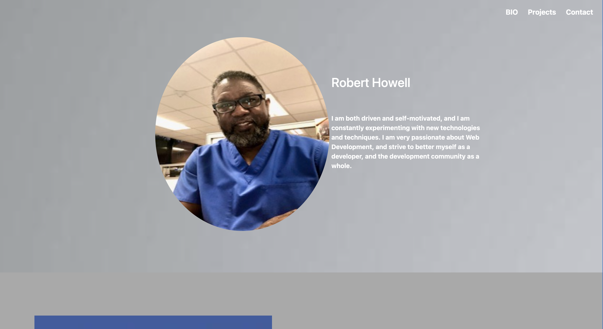
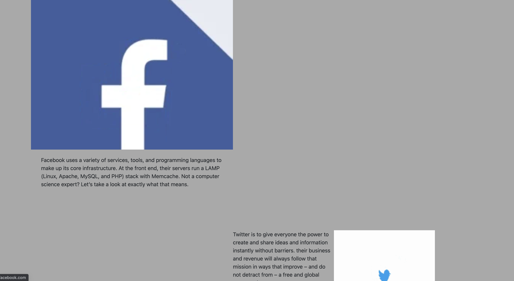
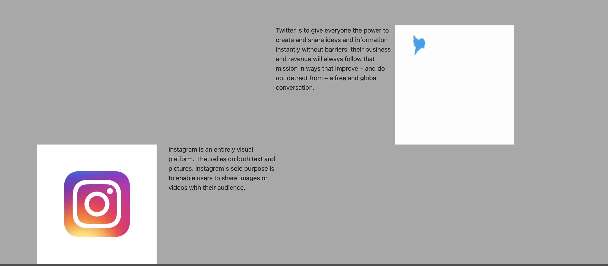

# Robert Web Dev Portfolio

My very first **Portfolio** as a **Web Developer**
My portfolio was created using **HTML** and **CSS**
It contains My contact information, previous projects, and my profile

Screenshots
 ### Profile

### Projects

### Projects 2nd view

### Contact Me

# iew my webpage: [Robert's Portfolio](https://lpnrhowell.github.io/portfolio/)
